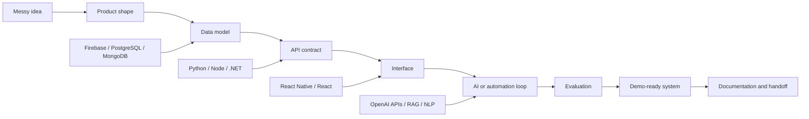

<p align="center">
  
</p>

<div align="center">

[](https://github.com/maharshi-coding)
[](#maharshios-runtime)
[](#mission-board)

</div>

```txt
> boot maharshi.profile
> load identity: AI + full-stack engineer
> load education: M.S. Computer and Information Science @ Texas A&M University-Corpus Christi
> load pattern: rough idea -> prototype -> evaluation -> usable product
> load output: software that can be demoed, shipped, explained, and handed off
> status: building
```

## The Non-Template Version

I am Maharshi Barot. I build at the point where AI stops being a prompt and becomes a working product: a mobile interface, a backend API, a database model, a route-aware map, realtime chat, payments, liveness checks, dashboards, or a workflow someone can actually use.

This profile is intentionally not a normal badge wall. It is a small map of how I think, build, test, explain, and hand off systems.

## MaharshiOS Runtime

<p align="center">
  
</p>

| Runtime module | Loaded capability | Real-world output |
| --- | --- | --- |
| `idea.kernel` | Converts unclear asks into product shape | scoped flows, requirements, demos |
| `ai.engine` | OpenAI APIs, prompt design, RAG thinking, LLM evaluation | assistants, tutors, automation loops |
| `product.shell` | React Native, React, Next.js, TypeScript | mobile apps, dashboards, interfaces |
| `system.drivers` | Firebase, FastAPI, Django, Node.js, .NET, SQL | auth, APIs, data, realtime features |
| `reality.adapters` | Mapbox, Stripe, OpenCV, Docker, GitHub Actions | maps, payments, liveness, CI/CD |

## Command Palette

```txt
maharshi build --mobile       React Native + Firebase + maps + payments
maharshi build --ai           OpenAI APIs + prompt loops + evaluation
maharshi build --backend      FastAPI / Django / Node / .NET + PostgreSQL
maharshi build --vision       OpenCV + embeddings + liveness + analytics
maharshi explain --handoff    docs that let the next person continue the system
```

## System Map

<table>
  <tr>
    <td width="25%" valign="top">
      <b>01. Intelligence Layer</b><br />
      OpenAI APIs, prompt engineering, RAG thinking, LLM evaluation, NLP, workflow automation.
    </td>
    <td width="25%" valign="top">
      <b>02. Product Layer</b><br />
      React Native, React, Next.js, TypeScript, Tailwind CSS, Bootstrap, usable frontend flows.
    </td>
    <td width="25%" valign="top">
      <b>03. Systems Layer</b><br />
      Firebase, Node.js, Express, Django, FastAPI, .NET 8, REST APIs, auth, RBAC, CI/CD.
    </td>
    <td width="25%" valign="top">
      <b>04. Reality Layer</b><br />
      PostgreSQL, MongoDB, Firestore, SQLite, Mapbox, Stripe, OpenCV, Docker, GitHub Actions.
    </td>
  </tr>
</table>

## How I Think About Building



## Mission Board

| Mission | What I built | System texture |
| --- | --- | --- |
| [AI Tutor Mobile App](https://github.com/maharshi-coding/ai-tutor-app) | A mobile AI tutoring experience powered by LLM APIs | React Native, TypeScript, OpenAI APIs, prompt iteration |
| RamayanaGPT | A domain-focused conversational assistant | LLM APIs, answer quality, prompt design, user-facing AI behavior |
| Campus Ride Pooling Mobile App | Campus ride creation, chat, auth, payments, identity, and route-aware matching | React Native, Firebase, Node.js, Mapbox, Stripe |
| [Face Recognition Attendance System](https://github.com/maharshi-coding/face-attendance-app) | Attendance platform with face embeddings and liveness detection | Python, FastAPI, OpenCV, JWT auth, RBAC, analytics, CSV/XLSX export |
| AI-Powered Retail Investor Dashboard | Market-data dashboard with realtime insights and interactive visuals | Python, React, SQL, REST APIs, data aggregation |

## Public Portals

<table>
  <tr>
    <td width="50%" valign="top">
      <a href="https://github.com/maharshi-coding/ai-tutor-app"><b>ai-tutor-app</b></a><br />
      TypeScript-first mobile AI work. Useful if you want to see how I shape AI into a product surface.
    </td>
    <td width="50%" valign="top">
      <a href="https://github.com/maharshi-coding/face-attendance-app"><b>face-attendance-app</b></a><br />
      Applied computer vision, backend auth, liveness checks, dashboards, and export workflows.
    </td>
  </tr>
  <tr>
    <td width="50%" valign="top">
      <a href="https://github.com/maharshi-coding/KAN-ODEs"><b>KAN-ODEs</b></a><br />
      Research-oriented machine learning and numerical experimentation.
    </td>
    <td width="50%" valign="top">
      <a href="https://github.com/maharshi-coding/reinforcement-learning"><b>reinforcement-learning</b></a><br />
      Reinforcement learning experiments and applied AI practice.
    </td>
  </tr>
</table>

## Build DNA

| Strand | Evidence from my work | Direction I keep pushing |
| --- | --- | --- |
| Product instinct | AI Tutor, Campus Ride, dashboards | make technical systems feel usable |
| AI depth | LLM apps, RAG thinking, evaluation loops | make AI outputs more reliable |
| Backend discipline | REST APIs, auth, RBAC, exports | make frontends easy to integrate |
| Realtime thinking | Firebase, chat, ride creation, live data | make systems respond like products |
| Applied ML | face embeddings, liveness checks, RL, KAN/ODE experiments | connect research ideas to working tools |

## Skill Deck

| Signal | Tools I use | What I use them for |
| --- | --- | --- |
| AI / LLM | OpenAI API, prompt engineering, RAG, LLM evaluation, NLP | assistants, tutoring flows, automation loops, quality tuning |
| Mobile | React Native, Firebase, Mapbox, Stripe | cross-platform product flows, realtime features, maps, payments |
| Frontend | React, Next.js, TypeScript, Tailwind CSS, Bootstrap | dashboards, app screens, interactive visual systems |
| Backend | Node.js, Express, Django, FastAPI, .NET 8 | REST APIs, auth, service integration, data pipelines |
| Data | PostgreSQL, MongoDB, Firestore, SQLite, SQL | product data models, analytics, storage, search, exports |
| Vision | Python, OpenCV, embeddings, liveness checks | face recognition, attendance systems, verification workflows |
| Dev Tools | Docker, Git, GitHub Actions, JWT, CI/CD | deployment readiness, automation, reproducible engineering |

## Origin

- M.S. in Computer and Information Science at Texas A&M University-Corpus Christi
- B.Tech in Computer Science and Engineering from Pandit Deendayal Energy University
- Diploma in Computer Engineering from Government Polytechnic, Ahmedabad

## I Am Usually The Person For

- turning an AI demo into an actual product flow
- connecting mobile apps to Firebase, APIs, maps, payments, and realtime data
- building backend services that frontend teams can understand and use
- explaining technical systems to non-technical users without losing the important details
- documenting the build so the next person is not trapped inside my head

<details>
  <summary><b>Open the hidden build notes</b></summary>
  <br />

```txt
Design rule:
A project is not finished when the code runs.
It is finished when the user understands it, the next engineer can continue it,
and the system can survive a real demo.

Personal constraint:
Make the work memorable without making it confusing.
```

</details>

---

<div align="center">

<b>Open to AI product engineering, full-stack development, mobile apps, backend APIs, and applied ML projects.</b>

</div>
